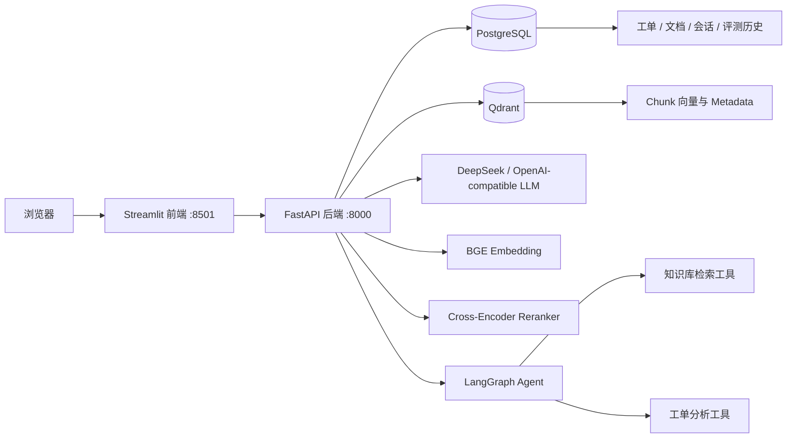

# 智能客服知识库与工单分析平台

基于 **RAG + Agent** 构建的智能客服知识库与工单分析平台，覆盖知识库管理、混合检索、Reranker 重排序、引用式问答、工单分析、多工具 Agent、数据持久化与离线评测等完整业务流程。

**Tech Stack：** FastAPI · PostgreSQL · Qdrant · LangGraph · BGE Embedding · BM25 · Cross-Encoder Reranker · Streamlit · Docker Compose

---

## ✨ 项目亮点

* 🔎 **Hybrid Retrieval**：结合 Dense Vector Search 与 BM25，实现语义检索与关键词检索互补
* 🎯 **Reranker 二阶段排序**：使用 Cross-Encoder 对召回结果重新排序，提高答案证据排名
* 📚 **引用式 RAG**：回答结果保留知识来源，支持引用溯源
* 🤖 **LangGraph Agent**：支持知识库检索、工单查询与工单分析等多工具调用
* 🗄️ **业务数据持久化**：使用 PostgreSQL 管理工单、文档、会话与评测记录
* 📊 **离线评测体系**：使用 Evidence Hit Rate、MRR 等指标量化检索效果
* 🐳 **Docker Compose**：统一编排 FastAPI、PostgreSQL、Qdrant 与 Streamlit 服务
* ✅ **自动化测试**：使用 pytest 覆盖 RAG、Agent、工单 CRUD 与持久化核心流程

---

## 📈 检索优化效果

针对“**检索到了正确文档，但排名靠前的 Chunk 并不包含答案**”的问题，对知识切分、Hybrid Retrieval 与 Reranker 流程进行了优化。

在 **12 道未参与调参的封存测试题**上：

| Retrieval Pipeline | Evidence Hit@3 | Evidence MRR@3 |
| ------------------ | -------------: | -------------: |
| Hybrid Retrieval   |         66.67% |         0.5139 |
| Hybrid + Reranker  |     **83.33%** |     **0.7917** |

改造后：

* **Evidence Hit@3：66.67% → 83.33%**
* **Evidence MRR@3：0.5139 → 0.7917**
* Evidence Hit@3 提升 **16.66 个百分点**
* Evidence MRR@3 提升 **0.2778**

完整实验设计、开发集 / 封存集划分与评测边界见：

[`RAG_EXPERIMENT_REPORT.md`](./RAG_EXPERIMENT_REPORT.md)

> 当前实验用于验证检索链路改造效果，不代表生产环境准确率。

---

## 🖥️ 项目预览

> 建议在这里加入 3～4 张真实运行截图：
>
> 1. 客服运营看板
> 2. RAG 知识库问答
> 3. Agent 工具调用与执行轨迹
> 4. 工单管理 / AI 分析
>
> 推荐将截图统一放在 `docs/images/` 目录中。

添加截图后可使用：

```md
### RAG 知识库问答


### Agent 工具调用


### 客服运营看板


```

---

## 🏗️ 系统架构



### 数据职责

**PostgreSQL**

负责结构化业务数据：

* 客服工单
* 文档目录
* RAG 会话
* 聊天消息
* 评测历史

**Qdrant**

负责知识库检索数据：

* Chunk 文本
* Embedding 向量
* source / title 等 metadata

两类数据库分别承担结构化业务数据和向量检索职责，避免业务数据库与向量数据库职责混杂。

---

# 🔍 核心功能

## 1. 知识库与 RAG

支持：

* TXT 等知识文档上传
* 文档切分与 Chunk 管理
* BGE Embedding 向量化
* Qdrant 向量索引
* BM25 关键词检索
* Dense + BM25 Hybrid Retrieval
* Cross-Encoder Reranker
* 引用式 RAG 问答
* 会话历史持久化

### 检索流程

```text
用户问题
   ↓
Query Embedding
   ↓
┌─────────────────┐
│ Dense Retrieval │
└─────────────────┘
          +
┌─────────────────┐
│ BM25 Retrieval  │
└─────────────────┘
          ↓
   Hybrid Fusion
          ↓
Cross-Encoder Reranker
          ↓
       Top-K
          ↓
     Prompt 构建
          ↓
         LLM
          ↓
回答 + 引用来源
```

---

## 2. 智能工单系统

支持完整工单 CRUD：

* 创建工单
* 分页查询
* 修改工单
* 删除工单
* 状态筛选
* 问题类型筛选
* 满意度筛选
* 日期筛选
* 关键词搜索

同时提供：

* 问题类型分布
* 工单状态分布
* 未解决率
* 低满意度率
* 每日趋势
* 周期对比
* AI 工单分析报告

CSV 示例数据仅作为系统首次启动时的种子数据，运行后的业务数据统一存储在 PostgreSQL 中。

---

## 3. LangGraph Agent

基于 LangGraph 构建多工具 Agent，根据用户问题选择不同工具执行。

当前主要工具包括：

* **知识库检索工具**
* **工单查询工具**
* **工单分析工具**

例如：

```text
用户：
最近支付问题投诉比较多吗？结合知识库给我处理建议。

        ↓

LangGraph Agent

        ↓

① 查询工单统计
② 判断主要问题类型
③ 检索对应知识库
④ 综合生成处理建议

        ↓

最终答案 + 工具执行轨迹
```

前端支持查看 Agent 的工具调用过程，方便观察 Agent 实际执行路径。

---

## 4. RAG / Agent 评测

项目没有只依赖“感觉回答挺准”，而是建立了基础离线评测流程。

RAG 检索指标包括：

* Evidence Hit Rate
* Evidence MRR
* Keyword Coverage
* Source Hit Rate

同时建立：

* 开发测试集
* 独立封存测试集
* 改造前基线
* 改造后结果

用于验证 Chunk 切分、Hybrid Retrieval 和 Reranker 等改动是否真正提高检索效果。

---

# 🧑‍💻 主要工作

项目重点围绕 RAG 检索链路、后端业务以及评测体系进行实现和优化，包括：

* 使用 FastAPI 构建后端 API，并划分 Route、Service、Repository 等模块
* 使用 PostgreSQL 持久化工单、文档、会话和评测数据
* 基于 Qdrant 构建知识库向量索引，实现 Embedding 入库与语义检索
* 将 TXT 固定字符切分优化为**段落优先切分**，降低跨主题 Chunk 干扰
* 实现 **Dense + BM25 Hybrid Retrieval**
* 接入 Cross-Encoder Reranker，对候选 Chunk 进行二阶段排序
* 将 `source`、`title` 与 `content` 共同加入 Reranker 输入
* 建立 Evidence Hit Rate、MRR 与关键词覆盖率等检索指标
* 设计开发测试题和独立封存测试题，对检索改造进行实验验证
* 基于 LangGraph 实现多工具 Agent 工作流
* 使用 pytest 覆盖 RAG、Agent、工单 CRUD 与持久化等核心流程
* 使用 Docker Compose 完成项目服务编排

---

# 📁 项目结构

```text
.
├── app/
│   ├── api/                    # FastAPI API 路由
│   ├── core/                   # 配置、日志
│   ├── db/                     # SQLAlchemy Engine、Model、初始化
│   ├── repositories/           # Qdrant / Ticket 数据访问
│   ├── schemas/                # Pydantic 请求响应模型
│   └── services/               # RAG、Agent、工单业务逻辑
│
├── frontend/
│   ├── app.py                  # Streamlit 主应用
│   ├── api_client.py           # 后端 API Client
│   └── Dockerfile
│
├── data/
│   ├── tickets.csv
│   ├── eval_questions.json
│   ├── eval_questions_holdout.json
│   ├── holdout_result.json
│   └── agent_eval_questions.json
│
├── storage/                    # 知识库文档
├── tests/                      # 自动化测试
│
├── docker-compose.yml
├── Dockerfile
├── Makefile
├── RAG_EXPERIMENT_REPORT.md
└── requirements.txt
```

---

# 🚀 快速启动

## 1. 准备环境变量

复制：

```bash
cp .env.example .env
```

Windows PowerShell：

```powershell
Copy-Item .env.example .env
```

如需调用大模型，在 `.env` 中配置：

```env
DEEPSEEK_API_KEY=YOUR_API_KEY
```

请勿将真实 API Key 提交到 GitHub。

---

## 2. Docker Compose 启动

```bash
docker compose up --build
```

也可以使用：

```bash
make up
```

启动后：

| 服务               | 地址                                |
| ---------------- | --------------------------------- |
| Streamlit 前端     | `http://localhost:8501`           |
| FastAPI Swagger  | `http://localhost:18000/docs`     |
| FastAPI Health   | `http://localhost:18000/health`   |
| Qdrant Dashboard | `http://localhost:6333/dashboard` |
| PostgreSQL       | `localhost:15432`                 |

首次启动可能需要下载 Embedding 与 Reranker 模型。

---

## 3. 停止服务

```bash
docker compose down
```

如需同时删除 PostgreSQL 与 Qdrant Volume：

```bash
docker compose down -v
```

> `-v` 会删除持久化 Volume，执行前请确认已有数据不再需要。

---

# 💻 本地开发

推荐 Python 3.12。

创建虚拟环境：

```bash
python -m venv .venv
```

Windows：

```powershell
.venv\Scripts\activate
```

macOS / Linux：

```bash
source .venv/bin/activate
```

安装后端依赖：

```bash
pip install -r requirements.txt
```

安装前端依赖：

```bash
pip install -r frontend/requirements.txt
```

启动 FastAPI：

```bash
uvicorn app.main:app --reload
```

启动 Streamlit：

### Windows PowerShell

```powershell
$env:API_BASE_URL="http://localhost:8000"
streamlit run frontend/app.py
```

---

# 🔌 主要 API

## 工单 API

| Method | Endpoint                   | Description |
| ------ | -------------------------- | ----------- |
| POST   | `/api/tickets`             | 创建工单        |
| GET    | `/api/tickets`             | 查询 / 分页筛选工单 |
| GET    | `/api/tickets/{ticket_id}` | 查询单条工单      |
| PATCH  | `/api/tickets/{ticket_id}` | 更新工单        |
| DELETE | `/api/tickets/{ticket_id}` | 删除工单        |
| GET    | `/api/tickets/dashboard`   | 获取运营看板      |
| GET    | `/api/tickets/ai-report`   | 生成 AI 工单分析  |

筛选示例：

```http
GET /api/tickets?status=未解决&issue_type=支付问题&satisfaction_lte=2&keyword=退款
```

---

## RAG / 知识库 API

| Method | Endpoint                       | Description                     |
| ------ | ------------------------------ | ------------------------------- |
| POST   | `/api/documents/upload`        | 上传知识文档                          |
| GET    | `/api/documents/list`          | 获取文档列表                          |
| GET    | `/api/documents/catalog`       | 查询数据库文档目录                       |
| DELETE | `/api/documents/{filename}`    | 删除知识文档                          |
| POST   | `/api/documents/vector/build`  | 重建向量索引                          |
| POST   | `/api/documents/vector/search` | Dense / BM25 / Hybrid Retrieval |
| POST   | `/api/chat/`                   | RAG 问答                          |

---

## Agent / Evaluation API

| Method | Endpoint                      | Description           |
| ------ | ----------------------------- | --------------------- |
| POST   | `/api/agent/run`              | 运行多工具 Agent           |
| GET    | `/api/agent/tools`            | 查询 Agent 工具           |
| POST   | `/api/eval/retrieval/compare` | 对比 Retrieval Pipeline |
| GET    | `/api/eval/agent/default`     | 运行 Agent 默认评测         |
| GET    | `/api/eval/runs`              | 查看评测历史                |

---

# 🗃️ 数据库设计

主要结构化数据表：

| Table             | Description      |
| ----------------- | ---------------- |
| `tickets`         | 客服工单             |
| `documents`       | 上传文档目录与索引状态      |
| `chat_sessions`   | RAG 会话           |
| `chat_messages`   | 会话消息与引用          |
| `evaluation_runs` | 评测配置、指标与 Case 结果 |

知识库 Chunk 正文、Embedding 和 metadata 存储在 Qdrant 中，不在 PostgreSQL 中重复保存。

---

# ✅ 自动化测试

执行：

```bash
pytest -q
```

当前版本：

```text
21 passed
```

测试覆盖：

* 文档 Chunk metadata
* Qdrant 本地模式
* Dense + BM25 Hybrid Retrieval
* Cross-Encoder Reranker
* Reranker 降级
* LangGraph Agent 工具调用
* Agent Evaluation
* 工单 CRUD
* 工单筛选
* 工单看板统计
* 会话持久化
* Evaluation History
* Streamlit / Docker Compose 基础结构

---

# 🎬 推荐 Demo 流程

1. 打开客服运营看板，展示工单类型、满意度和趋势
2. 创建一条低满意度工单并刷新看板
3. 上传知识文档并建立向量索引
4. 使用 RAG 提问并展示引用来源
5. 查看保存后的会话历史
6. 使用 Agent 分析投诉问题并结合知识库生成建议
7. 展开 Agent 工具调用轨迹
8. 运行 Retrieval Evaluation，对比 Hybrid 与 Hybrid + Reranker

---

# 🔭 后续计划

* [ ] 引入 Alembic 管理数据库 Migration
* [ ] 增加用户认证与 RBAC 权限
* [ ] 文档索引改为增量更新
* [ ] 使用任务队列处理大文件与耗时任务
* [ ] 加入 Prometheus / OpenTelemetry / LangSmith 可观测性
* [ ] 增加人工反馈与答案质量闭环

---

# 🔐 安全说明

* `.env` 已加入 `.gitignore`
* 仓库仅保留不包含真实密钥的 `.env.example`
* LLM API Key 通过环境变量提供
* Docker Compose 中数据库密码仅用于本地演示
* 公开部署前应修改数据库默认凭据
* 上传或提交知识库文档前，请确认其中不包含隐私或内部敏感信息
