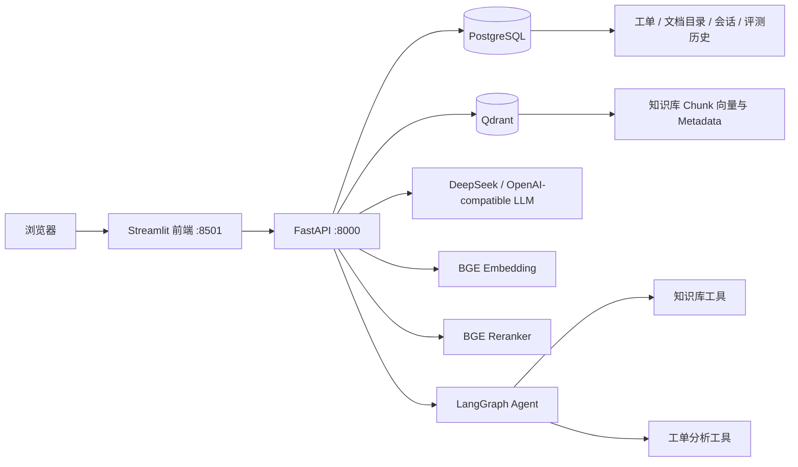

# 智能客服知识库与工单分析平台

这是一个可用于实习展示和继续扩展的 AI 工程项目，当前版本为 **v0.6.0（阶段 1～5）**。

项目将以下能力放在同一个业务闭环中：

- FastAPI 后端与自动 API 文档
- BGE Embedding + Qdrant 语义检索
- BM25 + Dense 混合召回
- Cross-Encoder Reranker 二阶段排序
- 引用式 RAG 问答
- LangGraph 多工具 Agent
- PostgreSQL 工单、文档目录、会话和评测记录持久化
- 工单 CRUD、筛选、趋势与风险统计
- Streamlit 可视化前端
- Docker Compose 一键启动
- 自动化测试与 RAG/Agent 评测

## 一、系统架构



PostgreSQL 管理结构化业务数据，Qdrant 管理知识库向量与片段 metadata。两者各干各的，避免为了“统一存储”把数据库活活用成瑞士军刀。

## 二、阶段 4 和阶段 5 的新增内容

### 阶段 4：数据库与业务闭环

- 使用 SQLAlchemy 2.x 管理数据库访问。
- Docker 环境默认使用 PostgreSQL。
- 测试与轻量本地运行支持 SQLite。
- 工单支持创建、读取、分页、更新、删除。
- 支持状态、问题类型、满意度、日期和关键词筛选。
- 支持问题类型分布、状态分布、未解决率、低满意度率、每日趋势和周期对比。
- CSV 示例工单仅作为数据库首次启动时的种子数据。
- RAG 会话及消息持久化。
- 文档上传后记录数据库目录信息。
- RAG 与 Agent 评测结果持久化。

### 阶段 5：可视化前端

Streamlit 前端包含：

1. 客服运营看板
2. 知识库上传、删除与检索
3. 引用式 RAG 问答与会话历史
4. 多工具 Agent 执行轨迹
5. 工单 CRUD 和 AI 分析报告
6. RAG / Agent 评测中心

## 三、项目目录

```text
.
├── app/
│   ├── api/                    # FastAPI 路由
│   ├── core/                   # 配置和日志
│   ├── db/                     # SQLAlchemy Engine、模型与初始化
│   ├── repositories/           # Qdrant / Ticket 数据访问层
│   ├── schemas/                # Pydantic 请求响应模型
│   └── services/               # RAG、Agent、工单和持久化业务层
├── frontend/
│   ├── app.py                  # Streamlit 主应用
│   ├── api_client.py           # 后端 API Client
│   └── Dockerfile
├── data/
│   ├── tickets.csv             # 首次启动种子数据
│   ├── eval_questions.json
│   └── agent_eval_questions.json
├── storage/                    # 上传的知识库文档
├── tests/
├── docker-compose.yml
├── Dockerfile
├── Makefile
└── requirements.txt
```

## 四、最快启动方式：Docker Compose

### 1. 准备环境变量

```bash
cp .env.example .env
```

需要调用大模型时，在 `.env` 中填写：

```env
DEEPSEEK_API_KEY=你的密钥
```

没有 API Key 时，RAG 和 Agent 仍有规则式降级结果，可用于运行和测试；答案表达会朴素一点，但不会躺平装死。

### 2. 启动全部服务

```bash
docker compose up --build
```

也可以使用：

```bash
make up
```

服务地址：

| 服务 | 地址 |
|---|---|
| Streamlit 前端 | `http://localhost:8501` |
| FastAPI Swagger | `http://localhost:8000/docs` |
| 健康检查 | `http://localhost:8000/health` |
| Qdrant Dashboard | `http://localhost:6333/dashboard` |
| PostgreSQL | `localhost:5432` |

首次启动会下载 Embedding 和 Reranker 模型，模型缓存保存在 Docker Volume 中。

### 3. 停止服务

```bash
docker compose down
```

连同数据库和 Qdrant 数据一起彻底清空：

```bash
docker compose down -v
```

这条命令比较凶，执行前确认不需要现有数据。

## 五、本地开发方式

### 1. 创建环境

建议 Python 3.12：

```bash
python -m venv .venv
```

Windows：

```bash
.venv\Scripts\activate
```

macOS / Linux：

```bash
source .venv/bin/activate
```

安装后端和测试依赖：

```bash
pip install -r requirements.txt
```

安装前端依赖：

```bash
pip install -r frontend/requirements.txt
```

### 2. 使用 SQLite 轻量运行

将 `.env` 中数据库改成：

```env
DATABASE_URL=sqlite+pysqlite:///./data/app.db
QDRANT_LOCAL_PATH=./data/qdrant_local
QDRANT_URL=http://localhost:6333
```

启动后端：

```bash
uvicorn app.main:app --reload
```

启动前端：

```bash
API_BASE_URL=http://localhost:8000 streamlit run frontend/app.py
```

Windows PowerShell：

```powershell
$env:API_BASE_URL="http://localhost:8000"
streamlit run frontend/app.py
```

## 六、主要 API

### 工单

| 方法 | 路径 | 作用 |
|---|---|---|
| POST | `/api/tickets` | 创建工单 |
| GET | `/api/tickets` | 分页筛选工单 |
| GET | `/api/tickets/{ticket_id}` | 查询单条工单 |
| PATCH | `/api/tickets/{ticket_id}` | 更新工单 |
| DELETE | `/api/tickets/{ticket_id}` | 删除工单 |
| GET | `/api/tickets/dashboard` | 获取看板数据 |
| GET | `/api/tickets/ai-report` | 生成工单分析报告 |

筛选示例：

```http
GET /api/tickets?status=未解决&issue_type=支付问题&satisfaction_lte=2&keyword=退款
```

### 知识库与 RAG

| 方法 | 路径 | 作用 |
|---|---|---|
| POST | `/api/documents/upload` | 上传文档并重建索引 |
| GET | `/api/documents/list` | 文件系统文档列表 |
| GET | `/api/documents/catalog` | 数据库文档目录 |
| DELETE | `/api/documents/{filename}` | 删除文档并重建索引 |
| POST | `/api/documents/vector/build` | 重建 Qdrant 索引 |
| POST | `/api/documents/vector/search` | Dense/BM25/Hybrid 检索 |
| POST | `/api/chat/` | RAG 问答并保存会话 |

### 会话

| 方法 | 路径 | 作用 |
|---|---|---|
| GET | `/api/conversations` | 会话列表 |
| GET | `/api/conversations/{session_id}` | 会话消息详情 |
| DELETE | `/api/conversations/{session_id}` | 删除会话 |

### Agent 与评测

| 方法 | 路径 | 作用 |
|---|---|---|
| POST | `/api/agent/run` | 执行多工具 Agent |
| GET | `/api/agent/tools` | 查看工具列表 |
| POST | `/api/eval/retrieval/compare` | 对比检索 Pipeline |
| GET | `/api/eval/agent/default` | 执行 Agent 默认评测 |
| GET | `/api/eval/runs` | 查看评测历史 |

## 七、数据库表

当前创建以下结构化表：

- `tickets`：客服工单
- `documents`：上传文档目录与索引状态
- `chat_sessions`：RAG 会话
- `chat_messages`：会话消息和引用来源
- `evaluation_runs`：评测配置、指标和 case 结果

知识库 chunk 的正文、向量和页码等 metadata 保存在 Qdrant，不在 PostgreSQL 重复存一份。

## 八、测试

运行：

```bash
pytest -q
```

当前交付版本验收结果：

```text
19 passed
```

测试覆盖：

- 文档切块 metadata
- Qdrant 本地模式
- Dense + BM25 融合
- Reranker 排序和降级
- LangGraph 多工具规划
- Agent 评测指标
- 工单 CRUD、筛选和冲突处理
- 工单看板统计
- 会话和评测历史持久化
- Streamlit 文件及 Docker Compose 结构

## 九、推荐演示顺序

1. 打开运营看板，展示工单类型、满意度和趋势。
2. 创建一条低满意度工单，再刷新看板。
3. 上传知识库文档并重建索引。
4. 用 RAG 问一个可引用文档的问题。
5. 打开会话历史，证明问答已持久化。
6. 让 Agent 分析投诉并结合知识库给处理建议。
7. 展开 Agent 工具链和执行轨迹。
8. 运行检索对比评测，展示工程不是只靠“感觉挺准”。

## 十、后续升级方向

- 增加 Alembic 数据库迁移
- 增加用户认证和角色权限
- 文档索引改为增量更新，而不是每次全量重建
- 后台任务队列处理大文件和模型推理
- 增加 Prometheus、OpenTelemetry 或 LangSmith 可观测性
- 加入人工反馈与答案质量闭环
